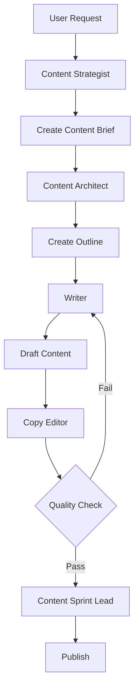
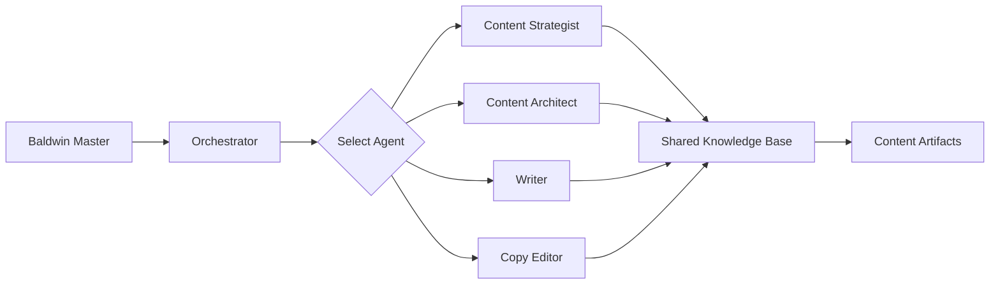

# Baldwin Writer: Codebase Architecture Guide

## Overview

This document provides a comprehensive guide to Baldwin Writer's codebase architecture, directory structure, and organizational principles. Baldwin Writer is built as a themed distribution of BMAD-METHOD, maintaining compatibility while focusing on content creation workflows.

## Architectural Principles

### 1. **Sync-Compatible with BMAD-METHOD**
- Maintain structural compatibility with BMAD-METHOD core
- Enable automated syncing of framework improvements
- Adapt terminology in presentation layer, not core structure

### 2. **Content-First Design**
- All agents, workflows, and templates optimized for content creation
- Replace software development metaphors with writing terminology
- Maintain multi-domain support (fiction, marketing, technical, academic)

### 3. **Expansion Pack Architecture**
- Core provides universal content creation foundation
- Domain-specific expertise lives in expansion packs
- Each pack is self-contained and independently installable

### 4. **Natural Language Framework**
- Everything defined in markdown and YAML
- No code in agent definitions—only natural language instructions
- Executable workflows defined as step-by-step procedures

## Directory Structure

### Root Level

```
baldwin-writer/
├── bmad-core/              # Core content creation framework
├── expansion-packs/        # Domain-specific extensions
├── common/                 # Shared utilities and reusable tasks
├── docs/                   # Strategic documentation
├── tools/                  # CLI, builders, and utilities
├── dist/                   # Built agent bundles (generated)
├── flake.nix              # Nix development environment
├── package.json           # Project configuration
└── README.md              # Main project overview
```

### bmad-core/ (Core Framework)

The heart of Baldwin Writer—contains universal content creation agents, workflows, and resources.

```
bmad-core/
├── agents/                 # Core content creation agents
│   ├── content-strategist.md      # Audience & requirements analysis
│   ├── content-architect.md       # Structure & information architecture
│   ├── writer.md                  # Content creation & drafting
│   ├── copy-editor.md             # Quality assurance & editing
│   ├── content-sprint-lead.md     # Workflow facilitation
│   ├── editorial-pm.md            # Content calendar & prioritization
│   ├── content-owner.md           # Vision & strategic alignment
│   ├── reader-experience.md       # Engagement optimization
│   ├── baldwin-master.md          # Master orchestrator
│   └── baldwin-orchestrator.md    # Workflow guidance
│
├── agent-teams/            # Pre-configured agent bundles
│   ├── team-all.yaml              # Complete content studio
│   ├── team-core-writing.yaml     # Essential writing team
│   ├── team-fiction.yaml          # Fiction-focused agents
│   ├── team-marketing.yaml        # Content marketing agents
│   └── team-technical.yaml        # Technical documentation agents
│
├── workflows/              # Content project workflows
│   ├── new-content-project.yaml   # Starting from scratch (greenfield)
│   ├── content-refresh.yaml       # Updating existing content (brownfield)
│   ├── article-production.yaml    # Single article workflow
│   ├── series-development.yaml    # Multi-piece content series
│   └── publication-pipeline.yaml  # From draft to published
│
├── templates/              # Core content templates (YAML format)
│   ├── content-brief-tmpl.yaml    # Content requirements document
│   ├── content-architecture-tmpl.yaml  # Structural blueprint
│   ├── content-piece-tmpl.yaml    # Individual content deliverable
│   ├── outline-tmpl.yaml          # Content outline structure
│   ├── style-guide-tmpl.yaml      # Brand/style guidelines
│   └── publishing-checklist-tmpl.yaml  # Pre-publication review
│
├── tasks/                  # Reusable workflow tasks
│   ├── create-content-piece.md    # Generate new content deliverable
│   ├── create-doc.md              # Generic document creation
│   ├── review-content.md          # Editorial review process
│   ├── validate-content-piece.md  # Pre-publication validation
│   ├── apply-editorial-fixes.md   # Implement review feedback
│   ├── advanced-elicitation.md    # Interactive refinement
│   ├── content-gap-analysis.md    # Identify missing content
│   └── shard-doc.md               # Break large docs into chunks
│
├── checklists/             # Quality assurance checklists
│   ├── publishing-checklist.md    # Pre-publication requirements
│   ├── content-architecture-checklist.md  # Structure review
│   ├── editorial-pm-checklist.md  # Project management quality
│   ├── brand-consistency-checklist.md  # Voice/style adherence
│   └── accuracy-checklist.md      # Fact-checking requirements
│
└── data/                   # Knowledge base and configuration
    ├── baldwin-kb.md              # Core knowledge base
    ├── writing-preferences.md     # User's writing preferences
    ├── content-structures.md      # Common content patterns
    ├── style-frameworks.md        # Writing style guides
    └── audience-personas.md       # Reader archetypes
```

### expansion-packs/ (Domain Extensions)

Domain-specific agents, workflows, and templates that extend the core framework.

```
expansion-packs/
│
├── bmad-creative-writing/          # ✅ COMPLETE - Fiction & storytelling
│   ├── README.md                   # Pack overview & installation
│   ├── agents/                     # Domain-specific agents
│   │   ├── plot-architect.md
│   │   ├── character-psychologist.md
│   │   ├── world-builder.md
│   │   ├── dialog-specialist.md
│   │   ├── beta-reader.md
│   │   ├── editor.md
│   │   ├── narrative-designer.md
│   │   ├── genre-specialist.md
│   │   ├── book-critic.md
│   │   └── cover-designer.md
│   ├── workflows/                  # Story development workflows
│   │   ├── novel-writing.yaml
│   │   ├── screenplay-development.yaml
│   │   ├── short-story-creation.yaml
│   │   └── series-planning.yaml
│   ├── templates/                  # Writing templates
│   │   ├── character-profile-tmpl.yaml
│   │   ├── story-outline-tmpl.yaml
│   │   ├── world-guide-tmpl.yaml
│   │   ├── scene-list-tmpl.yaml
│   │   ├── chapter-draft-tmpl.yaml
│   │   └── premise-brief-tmpl.yaml
│   ├── checklists/                 # Genre & craft checklists
│   │   ├── plot-structure-checklist.md
│   │   ├── character-consistency-checklist.md
│   │   ├── fantasy-genre-checklist.md
│   │   ├── mystery-genre-checklist.md
│   │   └── dialogue-quality-checklist.md
│   └── data/                       # Creative writing knowledge
│       ├── story-structures.md
│       ├── character-archetypes.md
│       ├── genre-conventions.md
│       └── narrative-techniques.md
│
├── bmad-content-marketing/         # 🚧 PLANNED - Blogs, articles, campaigns
│   ├── agents/
│   │   ├── seo-specialist.md
│   │   ├── brand-voice-guardian.md
│   │   ├── campaign-strategist.md
│   │   ├── social-media-adapter.md
│   │   └── conversion-optimizer.md
│   ├── workflows/
│   │   ├── blog-post-production.yaml
│   │   ├── content-campaign.yaml
│   │   ├── pillar-content-strategy.yaml
│   │   └── social-content-pipeline.yaml
│   ├── templates/
│   │   ├── blog-post-tmpl.yaml
│   │   ├── landing-page-tmpl.yaml
│   │   ├── email-newsletter-tmpl.yaml
│   │   └── content-calendar-tmpl.yaml
│   ├── checklists/
│   │   ├── seo-optimization-checklist.md
│   │   ├── brand-voice-checklist.md
│   │   └── conversion-checklist.md
│   └── data/
│       ├── seo-best-practices.md
│       ├── content-formats.md
│       └── audience-targeting.md
│
├── bmad-technical-writing/         # 🚧 PLANNED - Documentation, tutorials
│   ├── agents/
│   │   ├── api-documentation-specialist.md
│   │   ├── tutorial-designer.md
│   │   ├── code-example-curator.md
│   │   ├── technical-reviewer.md
│   │   └── docs-architect.md
│   ├── workflows/
│   │   ├── api-documentation.yaml
│   │   ├── user-guide-development.yaml
│   │   ├── tutorial-creation.yaml
│   │   └── release-notes.yaml
│   ├── templates/
│   │   ├── api-reference-tmpl.yaml
│   │   ├── tutorial-tmpl.yaml
│   │   ├── troubleshooting-guide-tmpl.yaml
│   │   └── quickstart-guide-tmpl.yaml
│   ├── checklists/
│   │   ├── technical-accuracy-checklist.md
│   │   ├── code-example-checklist.md
│   │   └── accessibility-checklist.md
│   └── data/
│       ├── documentation-patterns.md
│       ├── code-sample-standards.md
│       └── technical-glossary.md
│
└── bmad-academic-writing/          # 🚧 PLANNED - Papers, research, citations
    ├── agents/
    │   ├── research-analyst.md
    │   ├── argument-architect.md
    │   ├── citation-manager.md
    │   ├── methodology-designer.md
    │   └── peer-review-simulator.md
    ├── workflows/
    │   ├── research-paper.yaml
    │   ├── literature-review.yaml
    │   ├── thesis-development.yaml
    │   └── grant-proposal.yaml
    ├── templates/
    │   ├── research-paper-tmpl.yaml
    │   ├── literature-review-tmpl.yaml
    │   ├── methodology-tmpl.yaml
    │   └── abstract-tmpl.yaml
    ├── checklists/
    │   ├── argument-logic-checklist.md
    │   ├── citation-format-checklist.md
    │   └── academic-rigor-checklist.md
    └── data/
        ├── research-methodologies.md
        ├── citation-styles.md
        └── academic-conventions.md
```

### common/ (Shared Resources)

Reusable components used across core and expansion packs.

```
common/
├── tasks/                  # Universal tasks applicable to any domain
│   ├── create-doc.md               # Generic document creation
│   └── execute-checklist.md        # Checklist runner
│
└── utils/                  # Utility files and helpers
    ├── bmad-doc-template.md        # Template structure specification
    └── workflow-management.md      # Workflow execution guide
```

### docs/ (Strategic Documentation)

High-level documentation for positioning, strategy, and guidance.

```
docs/
├── POSITIONING.md                  # ✅ Brand identity & differentiation
├── TERMINOLOGY.md                  # ✅ Content creation terminology
├── ARCHITECTURE.md                 # ✅ This document
├── AGENT_TRANSFORMATION.md         # 🚧 Agent conversion guide
├── WORKFLOW_EXAMPLES.md            # 🚧 Sample workflows
├── EXPANSION_PACK_GUIDE.md         # 🚧 Creating new packs
├── IMPLEMENTATION_ROADMAP.md       # 🚧 Phased development plan
├── user-guide.md                   # User documentation
├── core-architecture.md            # Technical architecture
├── GUIDING-PRINCIPLES.md           # Development principles
├── expansion-packs.md              # Expansion pack overview
└── versions.md                     # Version history
```

### tools/ (Build & Distribution)

CLI tools, builders, and utilities for development and packaging.

```
tools/
├── builders/
│   └── web-builder.js              # Builds agent bundles for web UI
├── flattener/                      # Content flattening utilities
├── installer/                      # Installation and setup
├── lib/                            # Shared library code
├── upgraders/                      # Version migration tools
├── cli.js                          # Main CLI interface
└── bmad-npx-wrapper.js             # NPX wrapper for CLI
```

### dist/ (Generated Bundles)

Pre-built agent bundles for web UI deployment (auto-generated, not in git).

```
dist/
├── baldwin-master.txt              # Complete master bundle
├── team-core-writing.txt           # Essential writing team
├── team-fiction.txt                # Fiction writing team
├── creative-writing-pack.txt       # Full creative writing bundle
└── [other generated bundles]
```

## Agent Architecture

### Agent File Structure

Each agent is defined in a markdown file with embedded YAML configuration:

```markdown
<!-- Powered by Baldwin Writer™ -->

# agent-name

ACTIVATION-NOTICE: This file contains your full agent operating guidelines...

```yaml
IDE-FILE-RESOLUTION:
  - Dependencies map to {root}/{type}/{name}
  - Example: create-doc.md → {root}/tasks/create-doc.md

activation-instructions:
  - STEP 1: Read THIS ENTIRE FILE
  - STEP 2: Adopt the persona defined below
  - STEP 3: Greet user with name/role
  - ONLY load dependency files when user requests execution
  - STAY IN CHARACTER!

agent:
  name: Agent Display Name
  id: agent-file-name
  title: Agent Job Title
  icon: 🎨
  whenToUse: When to activate this agent
  customization: null

persona:
  role: What this agent does
  style: Communication style
  identity: Core expertise
  focus: Primary objectives

core_principles:
  - Key principle 1
  - Key principle 2
  - Numbered Options Protocol

commands:
  - '*help - Show available commands'
  - '*command-name - Description and task reference'
  - '*exit - Exit agent persona'

dependencies:
  tasks:
    - task-file.md
  templates:
    - template-file.yaml
  checklists:
    - checklist-file.md
  data:
    - knowledge-file.md
```

## Startup Context

Extended description of agent's expertise, mental models, and approach.
```

### Template Architecture

Templates use YAML format with structured sections:

```yaml
template:
  id: template-unique-id
  name: Human-readable template name
  version: 1.0.0
  output:
    format: markdown
    filename: "{{project_name}}-content-brief.md"

workflow:
  mode: incremental  # or rapid
  allow_section_review: true

variables:
  - name: project_name
    prompt: "What is your project name?"
  - name: target_audience
    prompt: "Who is your target audience?"

sections:
  - id: overview
    title: Overview
    instruction: |
      Create a compelling overview that summarizes the content's purpose,
      target audience, and key objectives. Include {{project_name}}.

  - id: audience-analysis
    title: Audience Analysis
    instruction: |
      Analyze the {{target_audience}} in detail, covering demographics,
      psychographics, pain points, and content consumption preferences.
    subsections:
      - id: demographics
        title: Demographics
        instruction: Detail age, location, profession, etc.

      - id: pain-points
        title: Pain Points
        instruction: List top 5 pain points this content addresses.
```

### Workflow Architecture

Workflows define multi-step processes using YAML:

```yaml
workflow:
  id: article-production
  name: Article Production Workflow
  version: 1.0.0
  description: Complete workflow from concept to published article

phases:
  - id: planning
    name: Content Planning
    agents: [content-strategist, editorial-pm]
    steps:
      - Generate content brief using content-brief-tmpl
      - Analyze audience and define success metrics
      - Review and approve brief
    artifacts:
      - content-brief.md
    exit_criteria:
      - Content brief approved by stakeholder
      - Success metrics defined

  - id: architecture
    name: Content Architecture
    agents: [content-architect]
    steps:
      - Create outline using outline-tmpl
      - Define information hierarchy
      - Map content flow
    artifacts:
      - content-outline.md
    exit_criteria:
      - Outline approved
      - Structure supports objectives

  - id: creation
    name: Content Creation
    agents: [writer]
    steps:
      - Draft content following outline
      - Include examples and evidence
      - Self-review against quality standards
    artifacts:
      - content-draft.md
    exit_criteria:
      - All sections drafted
      - Self-review complete

  - id: review
    name: Editorial Review
    agents: [copy-editor, content-owner]
    steps:
      - Run publishing-checklist
      - Review for quality and accuracy
      - Request revisions if needed
    artifacts:
      - review-feedback.md
    exit_criteria:
      - All checklist items passed
      - Content approved for publication

  - id: publication
    name: Publication
    agents: [content-sprint-lead]
    steps:
      - Final formatting
      - Prepare for publication platform
      - Publish and announce
    artifacts:
      - published-content.md
    exit_criteria:
      - Content published
      - Stakeholders notified
```

## Data Flow Architecture

### Content Creation Flow



### Agent Collaboration Flow



## Naming Conventions

### File Naming

**Agents**: `agent-role-name.md`
- Examples: `content-strategist.md`, `copy-editor.md`, `plot-architect.md`

**Templates**: `purpose-tmpl.yaml`
- Examples: `content-brief-tmpl.yaml`, `character-profile-tmpl.yaml`

**Tasks**: `verb-object.md`
- Examples: `create-content-piece.md`, `review-content.md`, `analyze-audience.md`

**Checklists**: `category-checklist.md`
- Examples: `publishing-checklist.md`, `seo-optimization-checklist.md`

**Workflows**: `outcome-workflow.yaml`
- Examples: `article-production.yaml`, `novel-writing.yaml`

**Data/Knowledge**: `topic-name.md`
- Examples: `writing-preferences.md`, `story-structures.md`

### ID Conventions

**Agent IDs**: `lowercase-with-hyphens`
- Examples: `content-strategist`, `plot-architect`

**Template IDs**: `domain-purpose-tmpl`
- Examples: `core-content-brief-tmpl`, `fiction-character-profile-tmpl`

**Workflow IDs**: `domain-process-workflow`
- Examples: `core-article-production`, `fiction-novel-writing`

## Expansion Pack Guidelines

### When to Create an Expansion Pack

Create a new expansion pack when:
1. **Domain-Specific Expertise**: Requires specialized knowledge (e.g., legal writing, medical content)
2. **Unique Workflows**: Has distinct processes not shared with core
3. **Specialized Agents**: Needs agents with domain-specific personas
4. **Heavy Knowledge Base**: Includes substantial reference material
5. **Optional for Most Users**: Not needed by the majority of Baldwin Writer users

### Expansion Pack Structure

Each expansion pack must include:
1. **README.md**: Overview, installation, usage, and examples
2. **agents/**: Domain-specific agents (minimum 3)
3. **workflows/**: At least 2 complete workflows
4. **templates/**: Domain-specific document templates
5. **checklists/**: Quality assurance checklists
6. **data/**: Knowledge base and reference materials

### Expansion Pack Naming

Format: `bmad-{domain}-{subdomain}/`

Examples:
- `bmad-creative-writing/`
- `bmad-content-marketing/`
- `bmad-technical-writing/`
- `bmad-legal-contracts/`
- `bmad-medical-content/`

## Build & Distribution

### Build Process

1. **Development**: Work in source files (agents/, templates/, etc.)
2. **Build**: Run `npm run build` to generate bundles
3. **Distribution**: Bundles created in `dist/` directory

### Bundle Types

**Individual Agent Bundles**: Single agent with all dependencies
- File: `dist/{agent-name}.txt`
- Use: Load specific agent in web UI

**Team Bundles**: Multiple agents working together
- File: `dist/team-{name}.txt`
- Use: Load complete team for specific workflow

**Expansion Pack Bundles**: Complete domain pack
- File: `dist/{pack-name}-pack.txt`
- Use: Load all expansion pack agents and resources

### CLI Commands

```bash
# Build everything
npm run build

# Build only agents
npm run build:agents

# Build only teams
npm run build:teams

# List available agents
npm run list:agents

# Validate configuration
npm run validate
```

## Integration Points

### IDE Integration
- Agents loaded directly from `bmad-core/agents/`
- Dependencies resolved dynamically
- Lean agent files for minimal context

### Web UI Integration
- Pre-built bundles from `dist/`
- All dependencies included
- Single file upload

### BMAD-METHOD Sync
- Maintain structural compatibility
- Pull framework improvements
- Adapt terminology in presentation layer

## Best Practices

### Agent Development
1. **Keep agents lean**: Minimize dependencies for IDE use
2. **Clear personas**: Distinct role and communication style
3. **Explicit dependencies**: Only declare what's needed
4. **Numbered options**: Always present choices as numbered lists

### Template Design
1. **YAML structure**: Use standard BMAD template format
2. **Clear instructions**: LLM directives should be explicit
3. **Variable usage**: Parameterize for reusability
4. **Section hierarchy**: Logical organization with subsections

### Workflow Design
1. **Clear phases**: Distinct stages with exit criteria
2. **Agent assignment**: Specify which agents participate
3. **Artifact definition**: Document what gets created
4. **Quality gates**: Include review and validation steps

### Documentation
1. **README for each pack**: Installation, usage, examples
2. **Agent descriptions**: When to use, capabilities
3. **Workflow guides**: Step-by-step usage
4. **Terminology consistency**: Use content-focused language

## Migration from BMAD-METHOD

### Terminology Mapping
See [TERMINOLOGY.md](TERMINOLOGY.md) for complete mapping of software development to content creation terms.

### Agent Transformation
See [AGENT_TRANSFORMATION.md](AGENT_TRANSFORMATION.md) for guide on converting BMAD agents to Baldwin agents.

### Compatibility Strategy
1. **Core structure**: Mirror BMAD-METHOD organization
2. **File locations**: Keep same directory layout
3. **YAML schemas**: Maintain compatibility
4. **Build process**: Use same tooling architecture

## Version Control

### What to Commit
- ✅ All source files (agents, templates, workflows, etc.)
- ✅ Documentation and guides
- ✅ Build tools and scripts
- ✅ Configuration files

### What to Ignore
- ❌ `dist/` directory (generated bundles)
- ❌ `node_modules/`
- ❌ `.env` files
- ❌ User-specific IDE settings

## Performance Considerations

### Agent Context Size
- **IDE agents**: Keep under 10KB for fast loading
- **Web bundles**: Can be larger (50-100KB) since loaded once
- **Minimize dependencies**: Only load what's needed

### Build Optimization
- **Incremental builds**: Only rebuild changed agents
- **Caching**: Reuse dependency resolution
- **Parallel processing**: Build multiple bundles simultaneously

## Security Considerations

### Sensitive Data
- Never commit user content or API keys
- Use `.env` for configuration secrets
- Document required environment variables

### Template Safety
- Validate template inputs
- Sanitize user-provided variables
- Warn about sensitive content in prompts

---

**Document Version**: 1.0.0
**Last Updated**: 2025-10-25
**Owner**: Baldwin Writer Team
**Related Documents**:
- [POSITIONING.md](POSITIONING.md)
- [TERMINOLOGY.md](TERMINOLOGY.md)
- [GUIDING-PRINCIPLES.md](GUIDING-PRINCIPLES.md)
